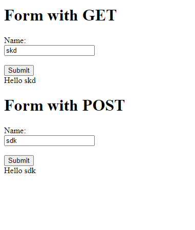
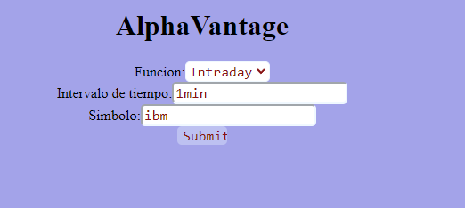

# Taller polygon y alphavantage

## Nicolas Palacios

## 28/08/2022

### En que consiste el proyecto?

Crear un servidor web, permitiendo multiples solicitudes seguidas concurrentes y consultando la api de Alphavantage y Polygon

LOC/H = 74

Para ingresar a la pagina principal se ingresara a http://localhost:8080  
El link de heroku es el siguiente:

para ejecutar en consola:

java -cp target/classes;target/dependency/ co.edu.escuelaing.SparkWebApp

Una vez en la pagina principal vera lo siguiente:  

En la opcion get y post realizaremos peticiones get y post para publicar lo escrito.

En alphaVantage podremos consultar acciones de la siguiente forma..

### Documentacion

Para ver la documentacion, se debe realizar el comando mvn javadoc:javadoc, luego en target/../index.html se visualizara esta.

## Estructura de Archivos

    .
    |____pom.xml
    |____src
    | |____main
    | | |____java
    | | | |____co
    | | | | |____edu
    | | | | | |____escuelaing
    | | | | | | |____SparkWebApp.java
    | | | | | | |____ApiGetter
    | | | | | | | |____APIClassGetter.java
    | | | | | | | |____Cache.java
    | | | | | | | |____Alphavantage
    | | | | | | | | |____AlphaGetter.java
    | | | | | | | | |____Daily.java
    | | | | | | | | |____Intraday.java
    | | | | | | | | |____Monthly.java
    | | | | | | | | |____Weekly.java
    | | | | | | | |____Polygon
    | | | | | | | | |____Aggregates.java
    | | | | | | | | |____OpenClose.java
    | | | | | | | | |____PolyGetter.java
    | | | | | | | | |____PrevousClose.java
